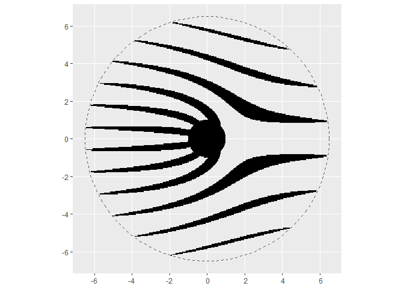
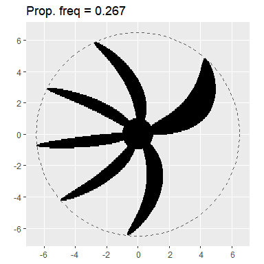
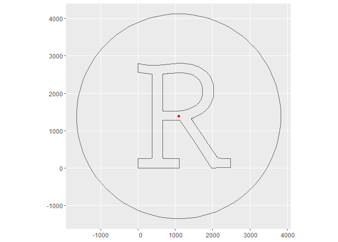

Rolling shutter simulation
================

## Introduction

-   Ever since I first saw an image similar to the one below, I’ve been
    fascinated by the rolling shutter effect you can observe with
    certain types of cameras when photographing fast moving objects
-   I’ve always wanted to try and simulate this behaviour, and this is
    my attempt using R
-   As usual, this may be inaccurate or incomplete - it’s just where
    I’ve got to with my current understanding


-   This work is powered by the `tidyverse` and `sf` packages

``` r
library(tidyverse)
library(sf)
```

## Create propeller geometry

-   Create a single propeller blade (ellipse) and the central hub (a
    circle)

``` r
center <- nngeo::st_ellipse(st_point(c(0,0)), ex = 1, ey = 1)
blade <- nngeo::st_ellipse(st_point(c(0,0)), ex = 0.5, ey = 3)
```

-   A function to rotate a geometry (taken from
    [here](https://r-spatial.github.io/sf/articles/sf3.html))

``` r
rot <- function(a) matrix(c(cos(a), sin(a), -sin(a), cos(a)), 2, 2)
```

-   Create the propeller by translating and rotating the blade around
    the central hub the required number of times

``` r
n_blades <- 6
angle <- (2*pi)/n_blades
    
prop_poly <-
    map(
        .x = seq(angle/2, 2*pi, by = angle), 
        .f = ~(blade + c(0, 3.5)) * rot(.x)) |> 
    reduce(c) |> 
    st_combine() |> 
    st_union(center)
```

-   Compute the propeller centroid and bounding box
-   Also compute the polygon and bounding box of a circle around the
    propeller

``` r
# Centroid and bounding box
prop_cntrd <- st_centroid(prop_poly)
prop_bb <- st_bbox(prop_poly)

# Circle polygon with radius of largest dimension in bbox and it's bbox
circle_poly <- st_buffer(prop_cntrd, max(st_distance(prop_cntrd, prop_poly |> st_cast("POINT"))))
circle_bb <- st_bbox(circle_poly)
```

-   Visualise the propeller

``` r
ggplot() + 
    geom_sf(data = st_as_sfc(circle_bb), fill = NA, col = "orange") +
    geom_sf(data = circle_poly, fill=NA, col="blue") + 
    geom_sf(data = prop_cntrd, col="red")+
    geom_sf(data = prop_poly, fill=NA)
```

<!-- -->

## Rotation and intersections

-   Develop some simple working code
    -   Define some parameters

``` r
# Total time for shutter to traverse whole image (seconds)
shutter_time <- 1

# Number of steps
res <- 300

# Vertical distance (top of image to bottom)
vertical_dist <- circle_bb["ymax"] - circle_bb["ymin"]

# Propeller rotations/second
propeller_freq <- 1.5
```

-   Generate a dataframe that has a row for each step of the image
-   For each row
    -   the shutter LINESTRING is moved one step
    -   the propeller is rotated one step
    -   the intersection of the two is computed

``` r
# Create dataframe of each frame
d <- 
  tibble(
      time = seq(0, shutter_time, l=res),
      angle = seq(0, 2*pi*shutter_time*propeller_freq, l=res),
      shutter_position = seq(circle_bb["ymax"], circle_bb["ymin"], l=res),
      shutter = 
          map(
              shutter_position,
              ~st_linestring(matrix(c(circle_bb["xmin"], .x, circle_bb["xmax"], .x),
                                    nrow = 2, 
                                    ncol = 2, 
                                    byrow = TRUE)))) |>
    mutate(prop = map(angle, ~(prop_poly - prop_cntrd)*rot(.x) * 1 + prop_cntrd)) |> 
    mutate(intersection = map2(shutter, prop, ~st_intersection(.x, .y))) |> 
    st_as_sf() |> 
    st_set_geometry("intersection")
```

-   Buffer the intersection linestrings (so there are no gaps) and
    visualise them all

``` r
# Shutter thickness (with small buffer)
shutter_thickness <- (vertical_dist/res)*1.1

# Visualise
ggplot() + 
    geom_sf(
        data = d |> st_buffer(shutter_thickness/2, endCapStyle = "FLAT"),
        col = NA,
        fill = 1) + 
    geom_sf(data = circle_poly, fill=NA, lty = 2)
```

<!-- -->

### Animation

-   Slightly buffer the intersections and shutter linestring to avoid
    any gaps in the output animation
-   Loop through each row saving a plot of the image up to that point
-   The animation was made (with the plots made here) outside of R using
    ImageJ

``` r
d_plot <- 
    d |> 
    st_buffer(shutter_thickness/2, endCapStyle = "FLAT") |> 
    st_set_geometry("shutter") |> 
    st_buffer(shutter_thickness/2, endCapStyle = "FLAT")

for(i in 1:nrow(d_plot)){

    ggplot()+
        geom_sf(data = d_plot$prop[[i]], col = NA, fill = "grey80") +
        geom_sf(data = d_plot$intersection[1:i], col = NA, fill = "black") +
        geom_sf(data = d_plot$shutter[i], fill = "red", col = NA) +
        geom_sf(data = circle_poly, col = NA, fill = NA)
    
    ggsave(paste0('out/', i, '.png'), width=5, height=5, dpi=200)
}
```


### Image function

-   Create a function that runs the above code for ease of visualising
    the output for different propeller frequencies

``` r
snap <- 
    function(
        shutter_time = 1,
        propeller_freq = 1.5,
        res = 200){
        
        # Using vertical distance defined outsie the function
        shutter_thickness <- (vertical_dist/res)*1.1
        
        tibble(
            time = seq(0, shutter_time, l=res),
            angle = seq(0, 2*pi*shutter_time*propeller_freq, l=res),
            shutter_position = seq(circle_bb["ymax"], circle_bb["ymin"], l=res),
            shutter = 
                map(
                    shutter_position,
                    ~st_linestring(matrix(c(circle_bb["xmin"], .x, circle_bb["xmax"], .x),
                                          nrow = 2, 
                                          ncol = 2, 
                                          byrow = TRUE)))) |>
            mutate(prop = map(angle, ~(prop_poly - prop_cntrd)*rot(.x) * 1 + prop_cntrd)) |> 
            mutate(intersection = map2(shutter, prop, ~st_intersection(.x, .y))) |> 
            st_as_sf() |> 
            st_set_geometry("intersection") |>
            st_buffer(shutter_thickness/2, endCapStyle = "FLAT") |> 
            ggplot() + 
            geom_sf(
                col = NA,
                fill = 1) + 
            geom_sf(data = circle_poly, fill=NA, lty = 2)
    }
```

-   Sweep propeller frequencies keeping the shutter time constant at 1s

``` r
walk(seq(0, 1, l=16), ~print(snap(propeller_freq = .x)+labs(title = paste0("Prop. freq = ", round(.x,3)))))
```



## Back projection

-   I was also interested to know if I could make this work ‘backwards’
    -   Could I rotate a pre-distorted ‘propeller’ that creates an
        undistorted final image?

### Create ‘pre-distorted’ image

-   This may not be quite right, but in order to create the
    pre-distorted propeller shape, my approach is to do the following
    for each time step:
    -   Compute the intersection of the undistorted final image with the
        position of the shutter
    -   Rotate that intersection backwards by the angle that the unknown
        shape would have rotated forwards at the current time step
-   I am choosing to rotate the intersections backwards about the
    centroid of the final image, but I think this could be changed if
    desired
-   Just for fun, I am also going to use a polygon of the letter `R` as
    my final image rather than a propeller in order to approximate the
    RStudio logo
-   As before, read polygon and compute centroid and bounding boxes

``` r
r_poly <- read_rds('character-R-poly.rds')

# Centroid and bounding box
r_cntrd <- st_centroid(r_poly)

# Largest distance from centroid to any point of the letter R polygon
radius <- max(st_distance(r_cntrd, st_cast(r_poly, "POINT")))

# Buffer by the radius plus a healthy expansion so the circle is much bigger than the letter R polygon
circle_poly <- st_buffer(r_cntrd, radius*1.4)
circle_bb <- st_bbox(circle_poly)
```

-   Visualise the final image of the R letter

``` r
ggplot() + 
    geom_sf(data = circle_poly, fill = NA) +
    geom_sf(data = r_poly, fill=NA) +
    geom_sf(data = r_cntrd, col="red")
```

<!-- -->

-   Define parameters
-   Here, the pre-distorted propeller cannot rotate by a large amount
    before it will intersect with the shutter more than once
    -   So I’m setting a low propeller frequency of 0.2

``` r
# Resolution for time steps
res <- 300

# Vertical distance
vertical_dist <- circle_bb["ymax"] - circle_bb["ymin"]

# Shutter thickness
shutter_thickness <- (vertical_dist/res)*1.1

# Shutter time (seconds)
shutter_time <- 1

# Propeller (rotations/second)
propeller_freq <- 0.2
```

-   Construct a dataframe with the time steps and shutter positions as
    above
-   Compute intersection of the final image (the letter R polygon) with
    the shutter at each time step
-   Rotate the intersection backwards by the angle it would have rotated
    forwards at each time step

``` r
back_proj <-
    tibble(
        time = seq(0, shutter_time, l=res),
        angle = seq(0, 2*pi*shutter_time*propeller_freq, l=res),
        shutter_position = seq(circle_bb["ymax"], circle_bb["ymin"], l=res),
        shutter = 
            map(
                shutter_position,
                ~st_linestring(matrix(c(circle_bb["xmin"], .x, circle_bb["xmax"], .x),
                                      nrow = 2, 
                                      ncol = 2, 
                                      byrow = TRUE)))) |>
    # Same as above to here
    mutate(final_image = st_geometry(r_poly)) |> 
    mutate(intersection = map2(shutter, final_image, ~st_geometry(st_intersection(.x, .y)))) |> 
    mutate(intersection_back_rot = 
               map2(
                   .x = angle, 
                   .y = intersection, 
                   .f = ~st_as_sf((.y - r_cntrd)*rot(-.x) * 1 + r_cntrd))) |>
    unnest(intersection_back_rot) |> 
    st_as_sf() |> 
    rename(back_rotation_geom = x) |> 
    st_set_geometry('back_rotation_geom')
```

-   Visualise the pre-distorted letter R polygon intersections

``` r
ggplot() + geom_sf(data = back_proj)
```

<!-- -->

-   I now buffer the linestring intersections to convert the overall
    image into a polygon

``` r
back_prop_poly <- 
  back_proj |> 
  st_buffer(12, endCapStyle = "FLAT") |> 
  st_union() |> 
  st_geometry()

ggplot() + geom_sf(data = back_prop_poly)
```

<!-- -->

### Create final image

-   Now run the simulation forward as before, using `back_prop_poly` as
    the ‘propeller’
-   This needs to be run at the same parameters that I used to above to
    create the pre-distorted `back_prop_poly`

``` r
d <- 
  tibble(
      time = seq(0, shutter_time, l=res),
      angle = seq(0, 2*pi*shutter_time*propeller_freq, l=res),
      shutter_position = seq(circle_bb["ymax"], circle_bb["ymin"], l=res),
      shutter = 
          map(
              shutter_position,
              ~st_linestring(matrix(c(circle_bb["xmin"], .x, circle_bb["xmax"], .x),
                                    nrow = 2, 
                                    ncol = 2, 
                                    byrow = TRUE)))) |>
    mutate(prop = map(angle, ~(back_prop_poly - r_cntrd)*rot(.x) * 1 + r_cntrd)) |> 
    mutate(intersection = map2(shutter, prop, ~st_intersection(.x, .y))) |> 
    st_as_sf() |> 
    st_set_geometry("intersection")
```

-   As before, buffer the shutter and intersections to avoid gaps in the
    final output
-   Create animation figures
-   Animation made (with these figures) outside of R using ImageJ

``` r
d_plot <- 
    d |> 
    st_buffer(shutter_thickness/2, endCapStyle = "FLAT") |> 
    st_set_geometry("shutter") |> 
    st_buffer(shutter_thickness/2, endCapStyle = "FLAT")

for(i in 1:nrow(d_plot)){

    ggplot()+
        geom_sf(data = circle_poly, col = NA, fill = "#75aadbff") +
        geom_sf(data = d_plot$prop[[i]], col = NA, fill = "grey") +
        geom_sf(data = d_plot$intersection[1:i], col = NA, fill = "white") +
        geom_sf(data = d_plot$shutter[i], fill = "red", col = NA)
        
    ggsave(paste0('out2/', i, '.png'), width=5, height=5, dpi=200)}
```


